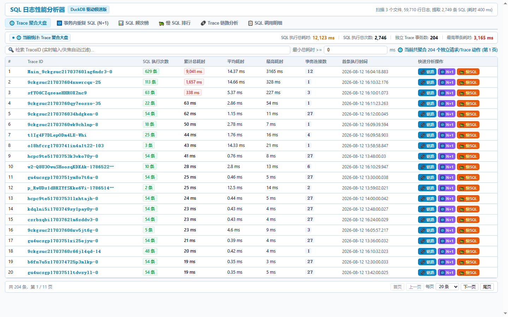
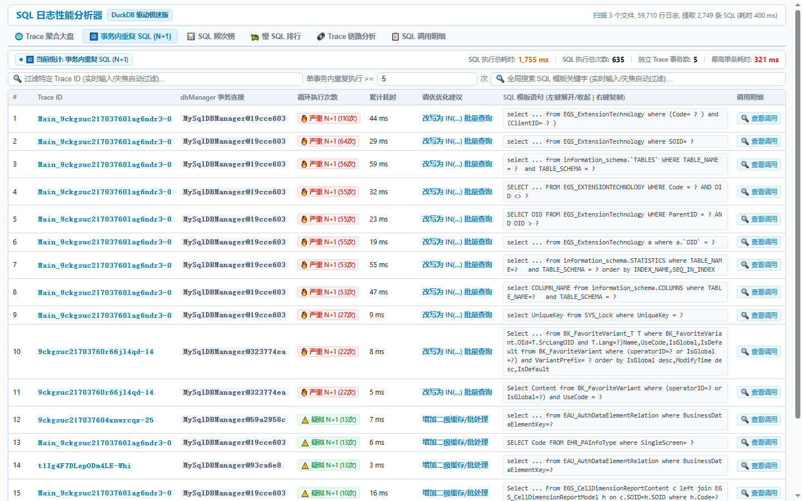
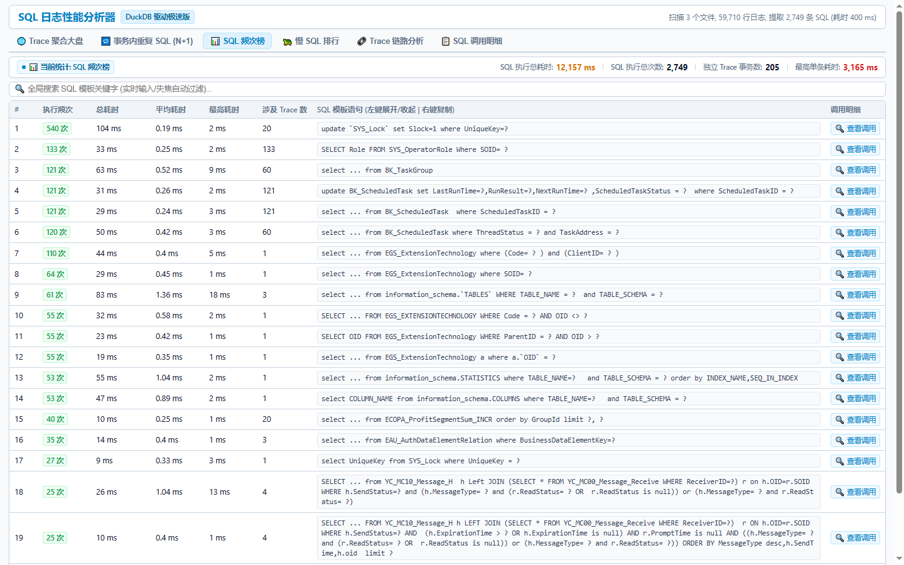
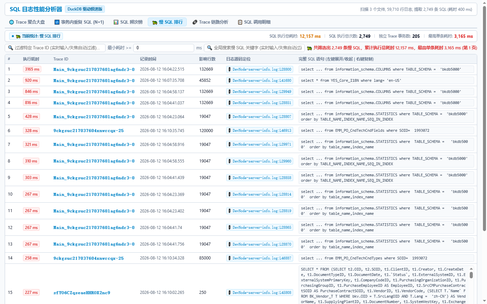
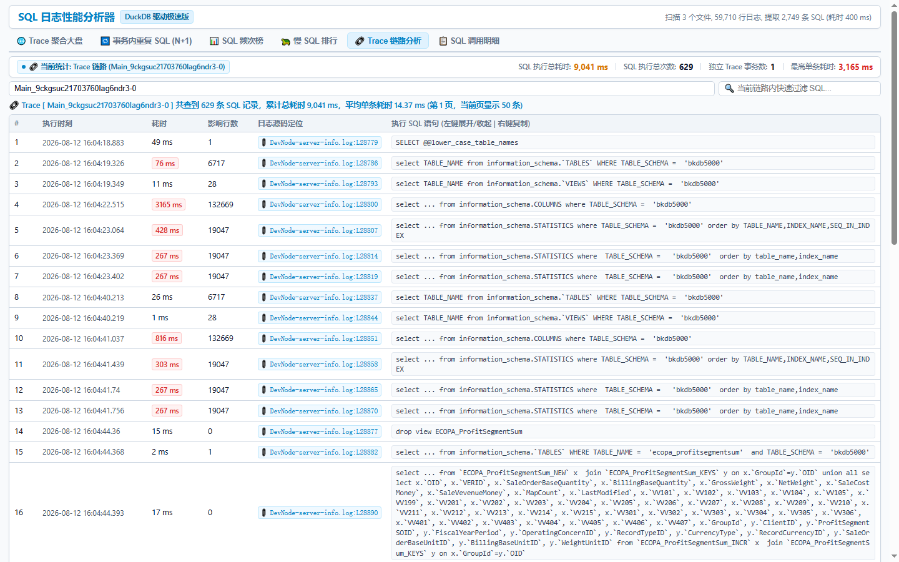
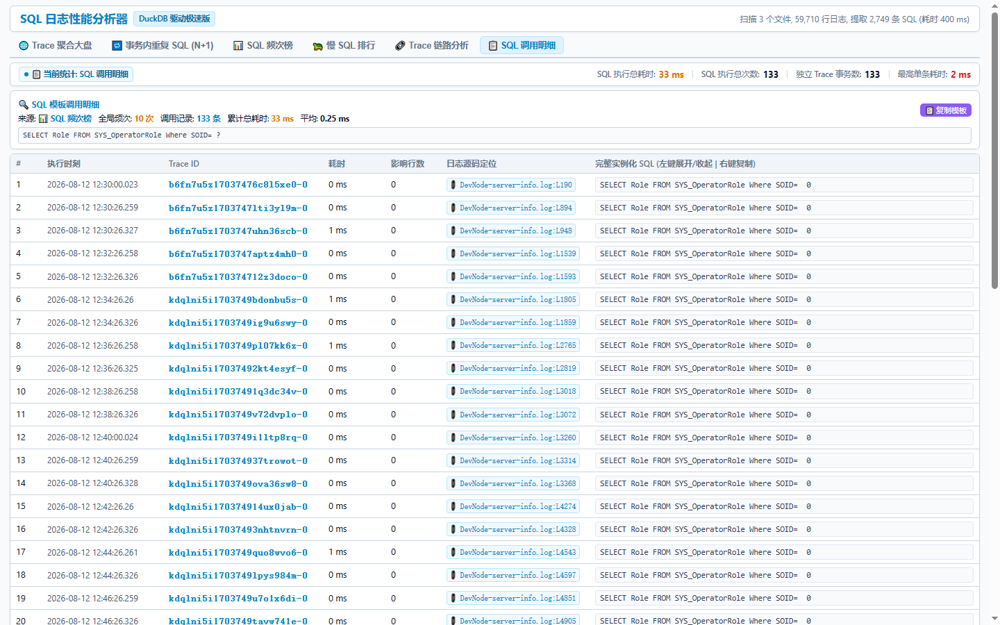

# 📖 SQL 日志分析器实战与操作指南 (User Guide)

`sqllog CLI` 是一款针对 ERP / YES 平台研发人员量身打造的高性能 SQL 日志分析、链路追溯与架构诊断工具。基于 **Node.js 多核并行流式解析** 与 **DuckDB C++ 纯内存向量计算引擎** 构建，帮助开发者在本地开发与自测调优阶段快速抓取 **N+1 循环隐患、慢 SQL 瓶颈、热点高频模板**，并实现**日志源码行号一键直达**。

---

## 🚀 1 秒快速开始

### 1. 全局安装

在终端执行以下命令（推荐 Node.js `v24+`）：

```bash
npm install -g git+https://github.com/believe-pxw/analyzeSqlLog.git --allow-git=all --allow-scripts=duckdb
```

### 2. 命令行启动分析

直接在当前开发目录或日志目录下运行：
```bash
sqllog .
```
或者指定日志目录 / 单个日志文件路径（支持 `.log` 文本与 `.log.gz` 压缩包）：
```bash
sqllog "D:\Users\boke\Desktop\source\bokeerp\erp-backend\logs"
```

控制台将在纯内存中瞬间完成解析装载，并自动唤起浏览器打开可视分析大盘（默认端口 `http://localhost:3000`）。

---

## 💡 七大核心功能视图操作详解

---

### ⚡ 1. 性能链路树 (全链路方法级性能剖析与火焰热点)

#### 核心作用
基于平台性能分析日志（`com.bokesoft.erp.performance.ActionRecorder`），以请求生命周期（Root 节点 `MidVEFilter.doFilter`）为根，**自顶向下完整构建 Java 业务方法、宏脚本运算、SQL 查询与事务提交的全链路方法调用树**。直观呈现业务耗时与数据库耗时在请求中的分布占比，秒级定位深层计算瓶颈。

#### 关键特性
1. **第一层核心 Service 业务动作识别**：在请求列表与分析视图中，自动提取第一层业务 Service/Macro 动作（如 `RichDocument/RichDocumentEvalMacro/.../Macro_LoadObject`），直观展示当前请求所承载的具体业务单据或功能。
2. **四维耗时全景分布条**：在列表中以彩色堆叠进度条直观展示：
   - 🟪 **Java 业务与宏运算耗时 (`biz_time_ms`)**
   - 🟦 **数据库 SQL 执行耗时 (`sql_time_ms`)**
   - 🟩 **事务提交阶段耗时 (`commit_time_ms`)**
   - ⬜ **线程调度与未覆盖间隙 (`gap_time_ms`)**
3. **🔥 Top 5 自耗时热点方法归因**：
   - 自动扣除所有子节点耗时，计算每个方法的**净自耗时 (`self_time_ms`)** 并严格降序排列；
   - 一键揪出占用 CPU 密集计算、低效循环或线程空转的热点方法。
4. **可折叠树形调用表格 & SQL 智能关联**：
   - 支持多层级缩进与 `+/-` 节点交互折叠/展开；
   - 自动提取并高亮关联 `QueryDatabase/` 下的多行 SQL 查询语句，支持左键展开与右键一键复制；
   - 提供「➕ 一键展开全部」、「➖ 一键收起全部」与「🔥 仅展开耗时 > 50ms 分支」等高效快捷操作；
   - 每一个调用动作与 SQL 均支持 **📂 VSCode 源码行号直达**。

---

### 🌐 2. Trace 聚合大盘 (全局性能宏观分析)



#### 核心作用
以业务请求（Trace ID）为维度进行全库聚合分组，帮助开发者从宏观视角快速找出**整个系统中最消耗数据库性能的业务请求**。

#### 关键特性
1. **总耗时优先排序**：默认第一排序字段为**累计总耗时 (`total_time_ms DESC`)**，第二排序字段为 **SQL 执行次数 (`sql_count DESC`)**。
2. **多维聚合指标**：清晰呈现单次 Trace 的 SQL 总执行次数、累计耗时、平均耗时、最高单条耗时、涉及的数据库连接数（事务句柄数）与首条 SQL 执行时刻。
3. **一键穿透深度分析**：
   - 点击 **「🔗 链路」**：瞬间跳转到 Trace 链路分析，按时间线还原所有 SQL；
   - 点击 **「🔁 N+1」**：携带该 TraceID 穿透到 N+1 诊断面板；
   - 点击 **「🐢 慢SQL」**：过滤展示该 TraceID 下的所有慢 SQL。

---

### 🔁 3. 事务内重复 SQL (N+1) 诊断 (独家精准排查)



#### 核心作用
开发过程中，在循环体（`for/while`）中查询数据库是导致接口性能低下的最主要诱因。本面板基于日志中的 `dbManager` 事务连接句柄，**精准识别在同一事务连接内的重复 SQL 循环执行**，彻底排除跨请求误报。

#### 关键特性
1. **严谨的事务级诊断**：精确区分连接句柄（如 `MySqlDBManager@19cce603`），确保只有在同一个数据库事务连接内的循环才会被抓取。
2. **自由调节循环阈值**：支持在顶部输入框自由手填循环次数阈值（如 `>= 5 次`、`>= 20 次`），输入即触发实时筛选。
3. **智能调优建议**：
   - **🔥 严重 N+1 (循环 ≥ 20 次)**：智能标注建议改写为 `IN(...)` 批量查询；
   - **⚠️ 疑似 N+1 (循环 5~19 次)**：建议增加二级缓存或合并批处理。
4. **一键查看调用**：点击行末「🔍 查看调用」即可精准下钻，查看该事务连接内每一次执行的具体 SQL 和行号。

---

### 📊 4. SQL 频次榜 (热点模板收敛)



#### 核心作用
对全库所有的参数化 SQL 模板进行归一化统计，找出系统运行期间**被调用次数最多、消耗资源总量最大的热点 SQL 模板**。

#### 关键特性
1. **参数化归一化聚合**：自动将 SQL 中的具体参数替换为占位符 `?` 进行 GROUP BY 聚合，统计全库总频次、累计耗时、平均耗时、最高耗时与涉及的独立 Trace 数。
2. **关键词全库搜索**：支持在搜索框输入表名或字段名，实时过滤匹配的 SQL 模板。
3. **下钻全库明细**：点击「🔍 查看调用」即可调出该模板在全库中每一次被调用的上下文详情。

---

### 🐢 5. 慢 SQL 排行 (单条耗时瓶颈定位)



#### 核心作用
按**单次执行耗时严格降序**排列，直击拖慢系统的单条性能杀手 SQL。

#### 关键特性
1. **多重联合过滤**：支持指定 Trace ID、最小耗时阈值（如 `>= 50 ms`）及关键词实时过滤。
2. **高精度单行时间戳**：时间戳（`YYYY-MM-DD HH:mm:ss.SSS`）单行排版，紧凑清晰。
3. **📂 VSCode 一键直达源码行号**：
   - 点击 `DevNode-server-info.log:L28800` 按钮，直接唤起 VSCode 并自动跳转定位到日志文件的对应行号；
   - 对于 `.gz` 压缩包日志，系统将在后台自动透明解压后打开。

---

### 🔗 6. Trace 链路分析 (请求全生命周期还原)



#### 核心作用
按日志原生时间线顺序，**100% 完整还原单次接口请求生命周期内的所有 SQL 执行时序图谱**。

#### 关键特性
1. **真实时序无损还原**：严格按日志产生先后展示执行时刻、耗时、影响行数与定位。
2. **链路内快速过滤**：支持在当前 Trace 内部快速搜索表名或关键字。
3. **耗时高亮警示**：单条耗时超过 50ms 的 SQL 自动使用醒目的红色标签标注。

---

### 📋 7. SQL 调用明细 (精准调用实例追踪)



#### 核心作用
展示指定 SQL 模板在全库或特定事务内的所有实际执行记录，用于**分析具体业务场景下传入的真实参数与执行开销**。

#### 关键特性
1. **全上下文追溯标签**：顶部信息栏清晰标注数据来源（频次榜或 N+1 诊断）、全局频次、调用记录总数、累计耗时与平均耗时。
2. **SQL 代码快速操作**：
   - **左键点击**：0ms 瞬间在精简压缩 SQL（`select ... from`）与完整 SQL 之间切换折叠/展开；
   - **右键点击**：弹出极简右键菜单，一键复制完整 SQL 到剪贴板；
   - **头部复制按钮**：点击右上角「📋 复制模板」快速提取参数化 SQL 模板。
3. **行号与日志定位**：每一条调用记录均包含完整的源文件绝对路径与行号链接。

---

## 🎯 典型性能调优实战场景

### 场景 A：接口响应变慢，如何 30 秒定位瓶颈？
1. 打开 **⚡ 性能链路树** 或 **🌐 Trace 聚合大盘**，查看排在首位（总耗时最高）的请求；
2. 在 **⚡ 性能链路树** 中查看四维耗时分布，秒级判断是 Java 业务耗时还是 SQL 数据库耗时占主导；
3. 查看 **Top 5 自耗时热点列表** 确定是哪个宏或 Service 自身运算缓慢，点击 VSCode 链接直达源码定位；
4. 若 SQL 耗时偏高，点击 **「🔗 链路」** 或 **「🔁 N+1」** 查看循环调用并重构。

### 场景 B：数据库 CPU 占用偏高，如何排查热点模板？
1. 打开 **📊 SQL 频次榜**，按执行频次降序查看；
2. 找出执行数千次但平均耗时极低的热点 SQL；
3. 点击 **「🔍 查看调用」** 查看其日志定位与所属 Trace，评估是否可以引入二级缓存或延迟加载机制。

---

## 📦 技术架构与底层保障

- **纯内存 DuckDB 向量引擎**：无任何磁盘持久化开销，数据在内存中以 Arrow Multi-row Chunk 向量化装载，毫秒级响应海量查询。
- **多核 Worker Threads 流式状态机**：多核子线程切块并行解析，支持 270,000+ 行/秒吞吐。
- **38 项全自动化测试保固**：内置基准性能、解析状态机、性能剖析树、DuckDB 向量化查询、HTTP API 与 DOM 渲染全流程 E2E 测试，保障极端场景下的 100% 稳定性。
